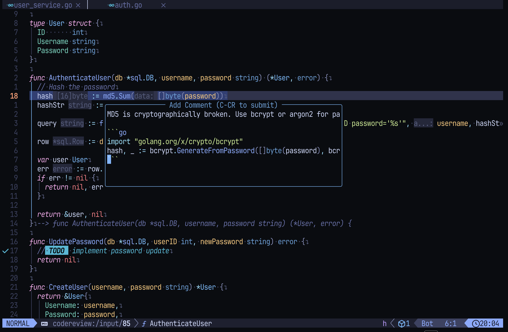
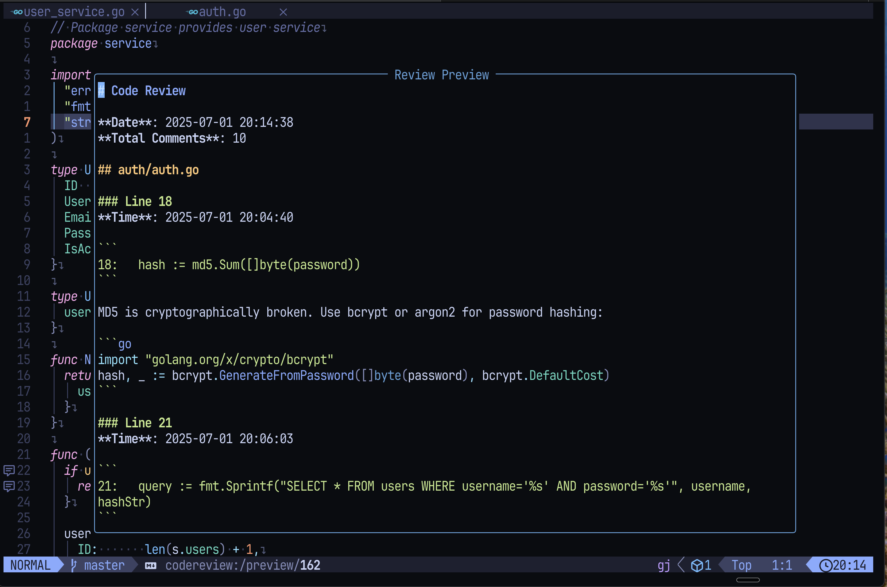
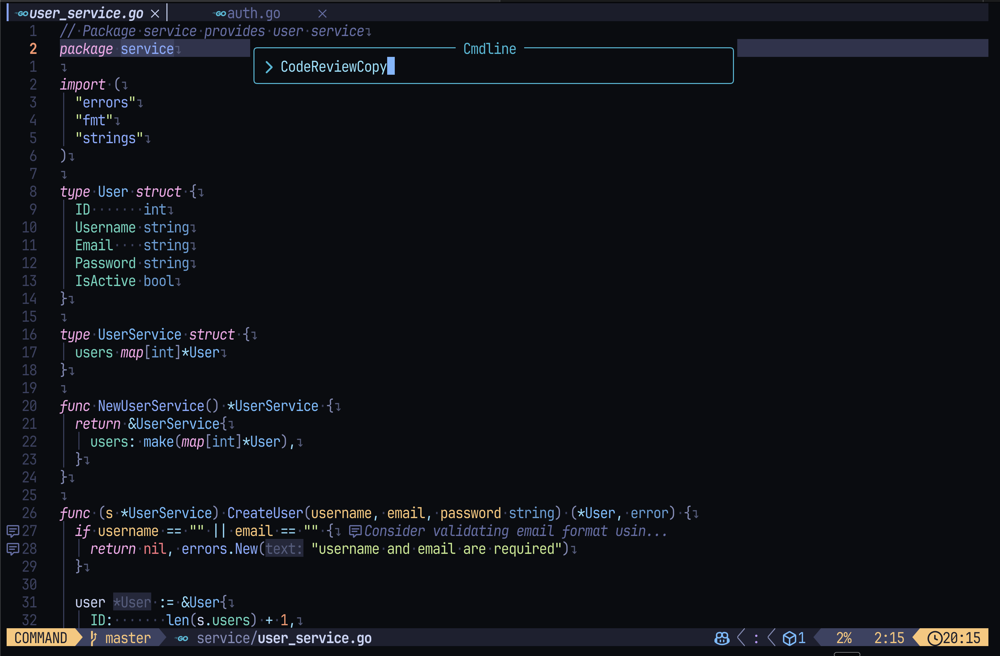
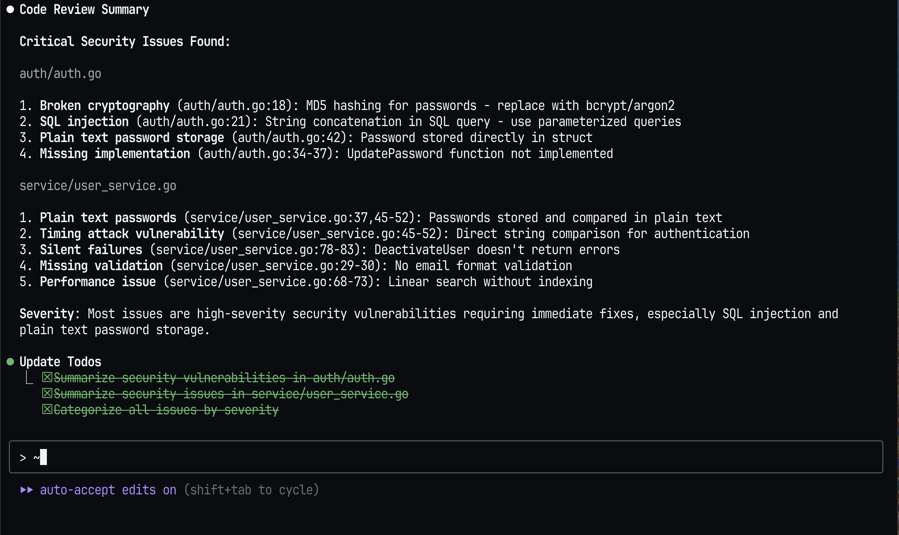
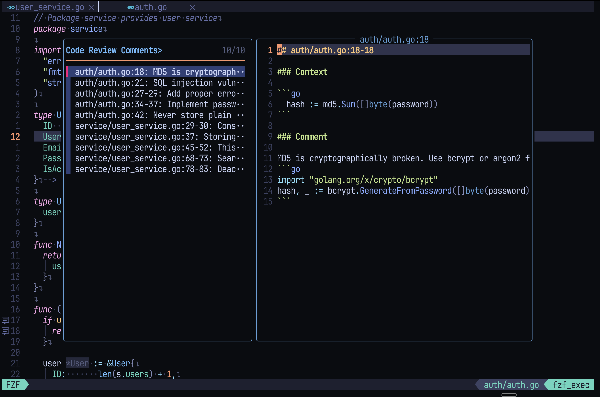
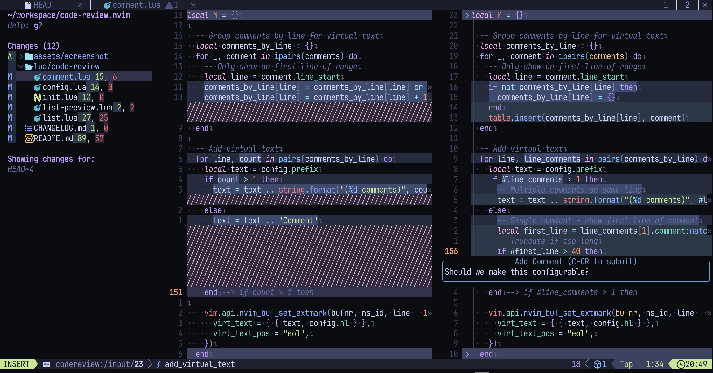

# 📝 code-review.nvim

[](https://neovim.io)
[](https://opensource.org/licenses/MIT)
[](https://github.com/choplin/code-review.nvim/releases)

Dead simple code reviews in Neovim designed for AI pair programming.

Add comments to any line or code block, export as structured Markdown, and paste to Claude, ChatGPT, or any AI assistant. They'll understand exactly what needs fixing.

## 📸 Screenshots

<table>
  <tr>
    <td width="50%">
      
      <p align="center"><b>1. Add comments with Markdown</b></p>
    </td>
    <td width="50%">
      
      <p align="center"><b>2. Preview all comments</b></p>
    </td>
  </tr>
  <tr>
    <td width="50%">
      
      <p align="center"><b>3. Copy all comments with one command</b></p>
    </td>
    <td width="50%">
      
      <p align="center"><b>4. Just paste - AI understands everything</b></p>
    </td>
  </tr>
</table>

## ✨ Features

- 🎯 **Instant feedback** - Comment on any line or code block with `<leader>rc`
- 📝 **Rich formatting** - Write proper reviews with Markdown support
- 🤖 **AI-ready export** - Share reviews with Claude, ChatGPT in one copy
- 👁️ **Smart navigation** - Jump between comments, view at cursor
- ✏️ **Live preview** - See and edit all your comments in one place
- 🔍 **Find comments** - List all with `<leader>rl` using Telescope, fzf, or quickfix
- 💬 **Thread discussions** - Reply to comments and resolve threads

## 📦 Installation

### Using [lazy.nvim](https://github.com/folke/lazy.nvim)

```lua
{
  'choplin/code-review.nvim',
  config = function()
    require('code-review').setup()
  end,
}
```

### Using [packer.nvim](https://github.com/wbthomason/packer.nvim)

```lua
use {
  'choplin/code-review.nvim',
  config = function()
    require('code-review').setup()
  end,
}
```

## 🚀 Quick Start

1. **Add a comment**: `<leader>rc` on any line or visual selection

   - Write your feedback in Markdown
   - Press `<C-CR>` to submit

2. **Preview all comments**: `<leader>rp` to see your complete review

3. **Copy to clipboard**: `<leader>ry` to copy everything

4. **Paste to AI**: Just paste in Claude, ChatGPT, or any AI assistant

That's it! Your AI will understand all your feedback perfectly.

## 🛠️ Configuration

<details>
<summary>Click to see default configuration</summary>

```lua
require('code-review').setup({
  -- UI settings
  ui = {
    -- Comment input window
    input_window = {
      width = 60,
      height = 2,
      max_height = 20,  -- Auto-expand up to this height
      border = 'rounded',
      title = ' Add Comment (C-CR to submit) ',
      title_pos = 'center',
    },
    -- Preview window
    preview = {
      split = 'vertical', -- 'vertical', 'horizontal', or 'float'
      vertical_width = 80,
      horizontal_height = 20,
      float = {
        width = 0.8,
        height = 0.8,
        border = 'rounded',
        title = ' Review Preview ',
        title_pos = 'center',
      },
    },
    -- Sign column indicators
    signs = {
      enabled = true,
      text = '┃',
      texthl = 'CodeReviewSign',
    },
    -- Virtual text indicators
    virtual_text = {
      enabled = true,
      prefix = ' 󰆉 ',
      hl = 'CodeReviewVirtualText',
    },
  },
  -- Output settings
  output = {
    date_format = '%Y-%m-%d %H:%M:%S',
    save_dir = nil, -- nil = current directory
  },
  -- Comment settings
  comment = {
    -- Storage configuration
    storage = {
      backend = 'memory', -- 'memory' or 'file'
      memory = {}, -- No memory-specific settings yet
      file = {
        -- Directory for file storage
        -- Relative paths: resolved from project root (git root or cwd)
        -- Absolute paths: used as-is
        dir = '.code-review',
      },
    },
    auto_copy_on_add = false, -- Automatically copy each new comment to clipboard when added
    -- Author name used by Claude Code (for automatic status management)
    -- Comments from this author trigger "waiting-review" status
    -- Comments from other authors trigger "action-required" status
    claude_code_author = 'Claude Code',
    -- Enable filename-based status management (only works with file storage backend)
    -- When enabled, review files are prefixed with status (action-required_, waiting-review_, resolved_)
    status_management = false,
  },
  -- Keymaps (set to false to disable all keymaps)
  keymaps = {
    clear = '<leader>rx',
    add_comment = '<leader>rc',
    preview = '<leader>rp',
    save = '<leader>rw',
copy = '<leader>ry',
    show_comment = '<leader>rs',
    list_comments = '<leader>rl',
    delete_comment = '<leader>rd',
  },
})
```

</details>

## 🔧 Advanced Configuration

<details>
<summary>Custom Keymaps and Autocmds</summary>

### Manual Keymap Setup

If you prefer to set up keymaps manually instead of using the `keymaps` config:

```lua
require('code-review').setup({
  keymaps = false,  -- Disable automatic keymaps
})

-- Set up your own keymaps
local cr = require('code-review')
vim.keymap.set({'n', 'v'}, '<leader>rc', cr.add_comment, { desc = "Add review comment" })
vim.keymap.set('n', '<leader>rp', cr.preview, { desc = "Preview review" })
vim.keymap.set('n', '<leader>rw', cr.save, { desc = "Save review to file" })
vim.keymap.set('n', '<leader>ry', cr.copy, { desc = "Copy review to clipboard" })
vim.keymap.set('n', '<leader>rs', cr.show_comment_at_cursor, { desc = "Show comment at cursor" })
vim.keymap.set('n', '<leader>rx', cr.clear, { desc = "Clear all comments" })
```

### Buffer-Specific Keymaps

You can set up keymaps for specific code-review buffers using autocmds:

```lua
-- Comment input buffer keymaps
vim.api.nvim_create_autocmd('User', {
  pattern = 'CodeReviewInputEnter',
  callback = function(ev)
    local buf = ev.data.buf
    local cr = require('code-review')
    local funcs = cr.get_input_buffer_functions(buf)

    -- Submit with C-CR in both insert and normal mode
    vim.keymap.set({'i', 'n'}, '<C-CR>', funcs.submit, { buffer = buf })
    -- Cancel with Esc or q in normal mode
    vim.keymap.set('n', '<Esc>', funcs.cancel, { buffer = buf })
    vim.keymap.set('n', 'q', funcs.cancel, { buffer = buf })
  end
})

-- Preview buffer keymaps
vim.api.nvim_create_autocmd('User', {
  pattern = 'CodeReviewPreviewEnter',
  callback = function(ev)
    local buf = ev.data.buf
    -- Custom keymaps for preview buffer
    vim.keymap.set('n', 'q', '<cmd>close<CR>', { buffer = buf })
    vim.keymap.set('n', '<C-s>', function()
      vim.cmd('write')  -- Save edits
      require('code-review').save()  -- Save to file
    end, { buffer = buf })
  end
})

-- Comment view buffer keymaps
vim.api.nvim_create_autocmd('User', {
  pattern = 'CodeReviewCommentsEnter',
  callback = function(ev)
    local buf = ev.data.buf
    vim.keymap.set('n', 'q', '<cmd>close<CR>', { buffer = buf })
    vim.keymap.set('n', '<Esc>', '<cmd>close<CR>', { buffer = buf })
  end
})
```

### Available User Events

- `CodeReviewInputEnter` - Fired when comment input window opens
  - `ev.data.buf` - Buffer number
  - `ev.data.win` - Window number
- `CodeReviewPreviewEnter` - Fired when preview window opens
  - `ev.data.buf` - Buffer number
- `CodeReviewCommentsEnter` - Fired when comment list window opens
  - `ev.data.buf` - Buffer number

### Helper Functions

```lua
-- Check if a buffer is a code-review buffer
local function is_code_review_buffer(bufnr)
  bufnr = bufnr or 0
  local name = vim.api.nvim_buf_get_name(bufnr)
  return name:match("^codereview://") ~= nil
end
```

</details>

## 📝 All Features

### Available Commands

| Command                      | Default Keymap | Description                                                 |
| ---------------------------- | -------------- | ----------------------------------------------------------- |
| `:CodeReviewComment [lines]` | `<leader>rc`   | Add comment at cursor/selection with optional context lines |
| `:CodeReviewShowComment`     | `<leader>rs`   | Show comments at cursor position                            |
| `:CodeReviewList`            | `<leader>rl`   | List all comments (Telescope/fzf-lua/quickfix)              |
| `:CodeReviewPreview`         | `<leader>rp`   | Open preview window with editable content                   |
| `:CodeReviewSave [path]`     | `<leader>rw`   | Save review to file                                         |
| `:CodeReviewCopy`            | `<leader>ry`   | Copy review to clipboard                                    |
| `:CodeReviewClear`           | `<leader>rx`   | Clear all review comments                                   |
| `:CodeReviewDeleteComment`   | `<leader>rd`   | Delete comment at cursor position                           |
| `:CodeReviewResolveThread`   | -              | Mark current thread as resolved                             |
| `:CodeReviewReopenThread`    | -              | Reopen a resolved thread                                    |

### Visual Indicators

| Feature      | Default             | Description                  |
| ------------ | ------------------- | ---------------------------- |
| Sign column  | `┃`                 | Shows on all commented lines |
| Virtual text | `󰆉 Comment text...` | Shows first line of comment  |

### Lua API

| Function                                            | Description                             |
| --------------------------------------------------- | --------------------------------------- |
| `require('code-review').add_comment(lines)`         | Add comment with optional context lines |
| `require('code-review').show_comment_at_cursor()`   | Show comments at cursor                 |
| `require('code-review').list_comments()`            | List all comments                       |
| `require('code-review').preview()`                  | Open preview window                     |
| `require('code-review').save(path)`                 | Save to file                            |
| `require('code-review').copy()`                     | Copy to clipboard                       |
| `require('code-review').clear()`                    | Clear all comments                      |
| `require('code-review').delete_comment_at_cursor()` | Delete comment at cursor                |

### Visual Mode Selection

1. Enter visual mode: `v` or `V`
2. Select the code range
3. Press `<leader>rc` to add a comment to the selection

### Editing Reviews

The preview buffer is fully editable. You can:

- Modify comment text directly
- Delete entire comment sections
- Reorder comments
- Save with `:w` to update the review
- Close with `q`

### Thread Discussions

Comments automatically create discussion threads. You can:

- **Reply to comments**: Use `<leader>rr` to reply to existing comments
- **Create new threads**: Use `<leader>rc` to start a new thread on the same line
- **Resolve threads**: Use `<leader>ro` to mark a thread as resolved
- Thread status is displayed in the comment list:
  - `[!]` Action Required - awaiting response from code author (Claude Code)
  - `[⏳]` Waiting Review - awaiting reviewer response
  - `[✓]` Resolved - discussion complete

#### Automatic Status Management

When using file storage backend, thread status is automatically managed based on the latest comment author:

- Comments from `claude_code_author` (configurable) → `waiting-review`
- Comments from other authors → `action-required`
- Manual resolution → `resolved`

This enables efficient workflow between AI assistants and human reviewers.

### Comment List Picker



The `:CodeReviewList` command (`<leader>rl`) automatically selects the best available picker:

1. **[Telescope](https://github.com/nvim-telescope/telescope.nvim)** (if installed)

   - Fuzzy search through comments
   - Live preview with syntax highlighting
   - Navigate with `j`/`k`, select with `<Enter>`

2. **[fzf-lua](https://github.com/ibhagwan/fzf-lua)** (if installed)

   - Fast fuzzy search
   - Full comment preview with Markdown highlighting
   - Navigate with `Ctrl-j`/`Ctrl-k`, select with `<Enter>`

3. **Quickfix** (fallback)
   - Native Vim list
   - `:cn`/`:cp` to navigate
   - `<Enter>` to jump to comment location

### Side-by-side Review with diffview.nvim



Perfect for PR reviews! Use code-review.nvim alongside [diffview.nvim](https://github.com/sindrets/diffview.nvim) to:

- Review diffs in split view
- Add comments while comparing changes
- See context from both old and new versions

## 📄 Output Format

Reviews are saved in a clean, readable Markdown format:

````markdown
# Code Review

**Date**: 2024-01-30 14:30:00
**Total Comments**: 3

## src/main.lua

### Line 42

**Time**: 2024-01-30 14:30:00

```lua
42: local function process_data(input)
```

This function needs error handling for nil input.

### Lines 100-105

**Time**: 2024-01-30 14:30:15

```lua
100: for i, item in ipairs(items) do
101:   if item.valid then
102:     table.insert(results, item)
103:   end
104: end
```

Consider using table.filter for better readability.
````

## 💾 Storage Backends

code-review.nvim supports two storage backends:

### Memory Storage (Default)

Comments are stored in memory during your Neovim session. This is the default behavior.

```lua
require('code-review').setup({
  comment = {
    storage = {
      backend = "memory",  -- Default
    },
  },
})
```

### File Storage

Comments are stored as individual files on disk, perfect for:

- Persistent reviews across sessions
- Real-time monitoring by external tools
- Integration with AI assistants

```lua
require('code-review').setup({
  comment = {
    storage = {
      backend = "file",
      file = {
        dir = ".code-review",    -- Default: project root/.code-review/
        -- dir = ".reviews",     -- Alternative: project root/.reviews/
        -- dir = "~/reviews",    -- Absolute path: ~/reviews/
      },
    },
  },
})
```

#### How File Storage Works

1. Each comment is saved as a separate file: `YYYY-MM-DD-HHMMSS-NNN.md`
2. Files are saved to:
   - Relative paths: Resolved from project root (git root if available, otherwise cwd)
   - Absolute paths: Used as-is
   - Default: `{project_root}/.code-review/`
3. Comments persist across Neovim sessions
4. External tools can monitor the directory for new files

## 🔨 Development

### Setup

```bash
# Install formatter and linter
cargo install stylua
luarocks install luacheck

# Clone test dependencies
git clone --depth 1 https://github.com/echasnovski/mini.nvim deps/mini.nvim
```

### Commands

```bash
# Format code
make format

# Run linter
make lint

# Run both formatter and linter
make check

# Run tests
make test

# Run specific test
make test-formatter
```

### Testing

Tests are written using [mini.test](https://github.com/echasnovski/mini.nvim/blob/main/readmes/mini-test.md). Test files should be placed in the `tests/` directory with the naming pattern `test_*.lua`.

## 🤝 Contributing

Contributions are welcome! Please feel free to submit a Pull Request.

## 📜 License

MIT License - see LICENSE file for details
